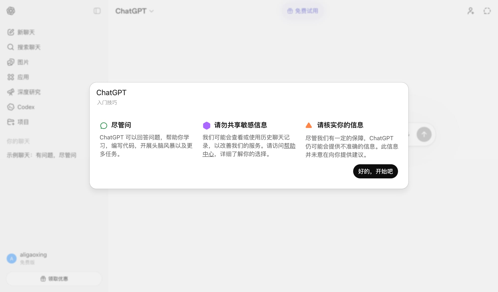
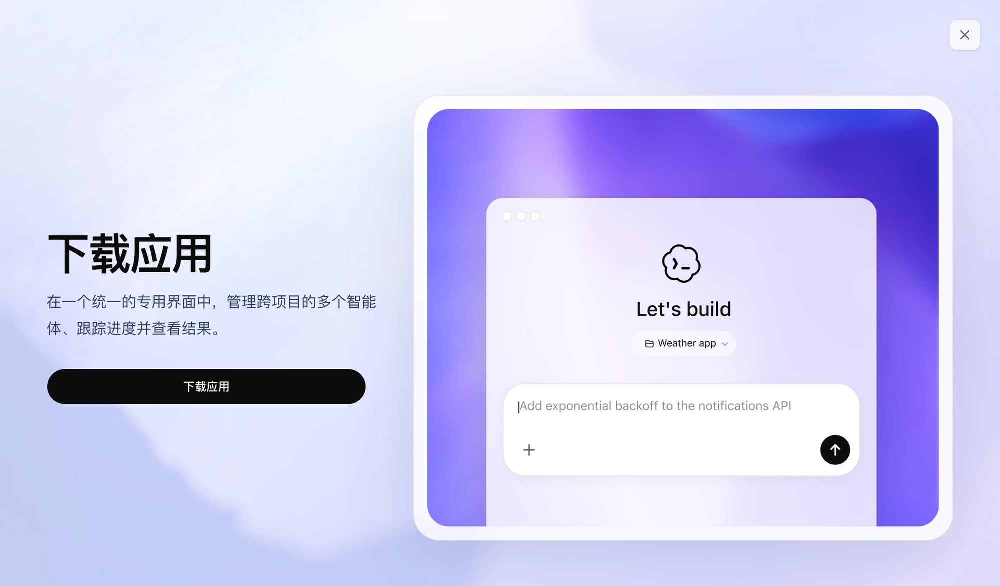
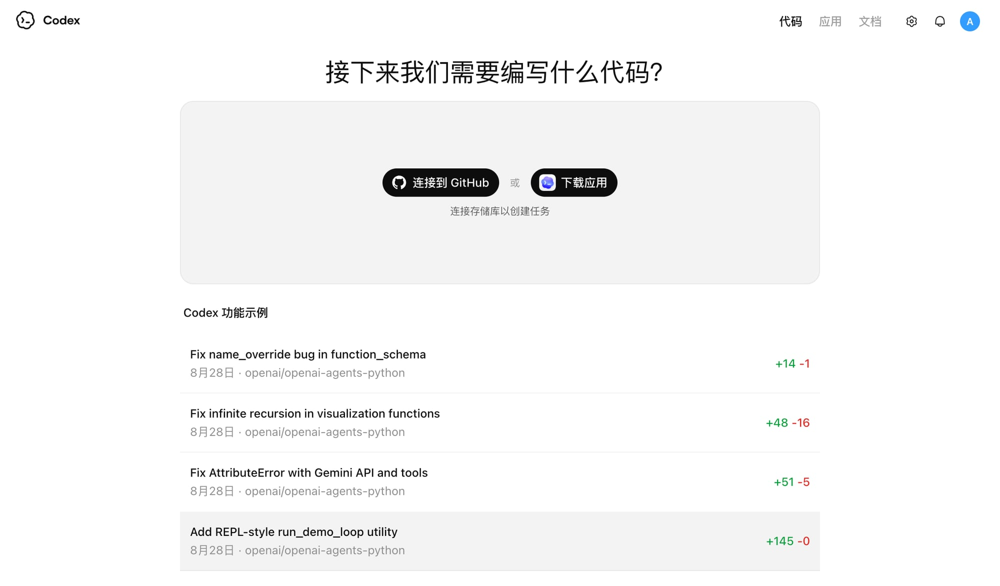
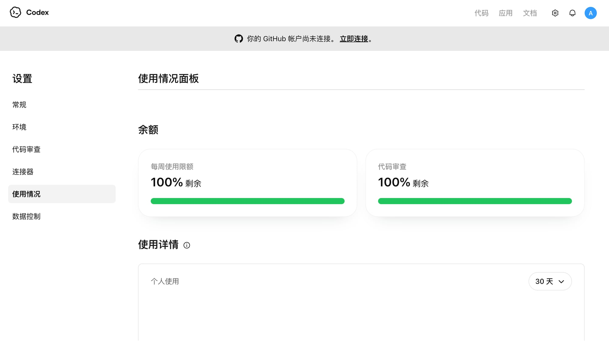
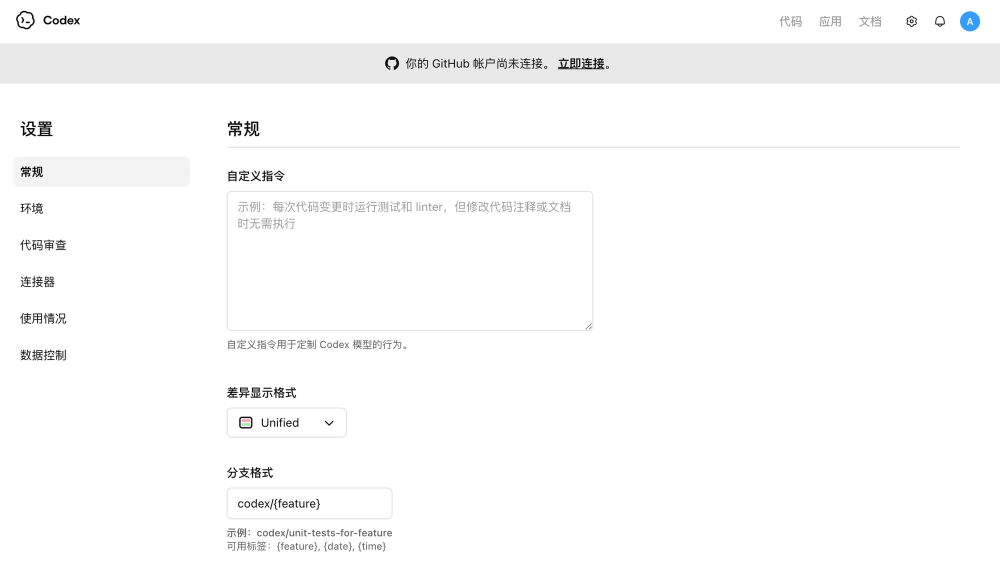

# 🦞 免费安装小龙虾（OpenClaw）— Codex 方案

> **实测验证**：2026年3月22日，我们用免费 ChatGPT 账号完整走通了全流程。  
> **适用系统**：macOS（Apple Silicon / Intel 均可）  
> **费用**：0 元  
> **耗时**：约 10 分钟

---

## 💡 这个方案的原理

OpenAI 的 Codex（编程 AI 助手）可以免费使用，而 Codex App 内置了完整的开发环境（Node.js 等），刚好能跑小龙虾。**你不需要懂编程，像装微信一样操作就行。**

---

## 第一步：注册免费 ChatGPT 账号

打开 https://chatgpt.com ，点「免费注册」，用邮箱注册即可。

> ⚠️ 需要能收验证码的邮箱（推荐 Gmail）

注册成功后，你会看到这样的界面——注意左下角显示「**免费版**」，侧栏有「**Codex**」入口：



---

## 第二步：下载 Codex App

两种方式任选：

**方式 A：从 ChatGPT 侧栏进入**
1. 点击左侧「Codex」
2. 弹窗提示下载应用，点「下载 macOS 版」



**方式 B：直接下载**
- 下载链接：https://persistent.oaistatic.com/codex-app-prod/Codex.dmg

下载完成后，打开 .dmg 文件，把 Codex 拖到「应用程序」文件夹。

---

## 第三步：登录 Codex App

1. 打开「应用程序」中的 **Codex**
2. 选择「Sign in with ChatGPT」
3. 用刚才注册的免费账号登录

登录后你会看到 Codex 主界面，可以连接 GitHub 或直接开始：



---

## 第四步：安装小龙虾

在 Codex 里新建一个任务，输入以下指令：

```
请帮我安装 openclaw（小龙虾），一个 AI 助手框架。
安装命令是：npm install -g openclaw
安装完成后，运行 openclaw setup 进行初始化配置。
```

Codex 会自动执行安装。如果它问你任何确认，都选「Approve」。

> 💡 Codex 自带 Node.js 环境，不需要你单独安装任何东西。

---

## 第五步：配置小龙虾

安装完成后，在 Codex 里继续输入：

```
运行 openclaw setup，帮我完成配置。
我需要连接 Telegram，请引导我完成。
```

按照提示操作即可。你需要准备：
- 一个 Telegram 账号
- 一个 AI 模型的 API Key（Codex 会引导你获取）

---

## 第六步：开始使用

配置完成后，运行：

```
openclaw gateway start
```

你的小龙虾就活了！🦞

---

## 📊 免费版额度说明

免费 ChatGPT 账号的 Codex 有每周使用限额，实测截图如下：



- **每周使用限额**：有限但够用（安装小龙虾只需要几次对话）
- **代码审查**：单独的额度池
- 额度每周重置

> 对于安装和配置小龙虾来说，免费额度绑绑有余。日常维护偶尔打开 Codex 调整一下也够用。

---

## ⚙️ Codex 设置（可选）

登录后可以在设置页面自定义 Codex 的行为：



- **自定义指令**：可以写上「请用中文回复」
- **环境**：可以配置运行环境
- **连接器**：可以连接 GitHub

---

## ❓ 常见问题

**Q：真的完全免费吗？**  
A：是的。ChatGPT 免费账号可以使用 Codex，OpenClaw 本身也是免费开源的。唯一可能的费用是 AI 模型的 API（但有很多免费额度的选择）。

**Q：为什么不直接用终端安装？**  
A：可以！如果你会用终端，直接 `npm install -g openclaw` 更快。这个教程是给不熟悉命令行的朋友准备的。

**Q：安装后 Codex App 还需要保留吗？**  
A：小龙虾安装完就是独立运行的，不依赖 Codex。但建议保留 Codex，以后维护升级很方便。

**Q：Windows 能用吗？**  
A：目前 Codex App 只支持 macOS。Windows 用户可以用 Codex CLI（`npm i -g @openai/codex`），但需要先自己安装 Node.js。

**Q：会影响我电脑上已有的程序吗？**  
A：不会。Codex App 是独立应用，小龙虾也安装在独立目录，互不干扰。

---

## 🔗 相关链接

- [OpenClaw 官方文档](https://docs.openclaw.ai)
- [OpenClaw GitHub](https://github.com/openclaw/openclaw)
- [Codex 官方文档](https://platform.openai.com/docs/codex/overview)
- [ChatGPT](https://chatgpt.com)

---

> 📸 本教程所有截图均为 2026年3月22日 实测拍摄，使用免费 ChatGPT 账号。
